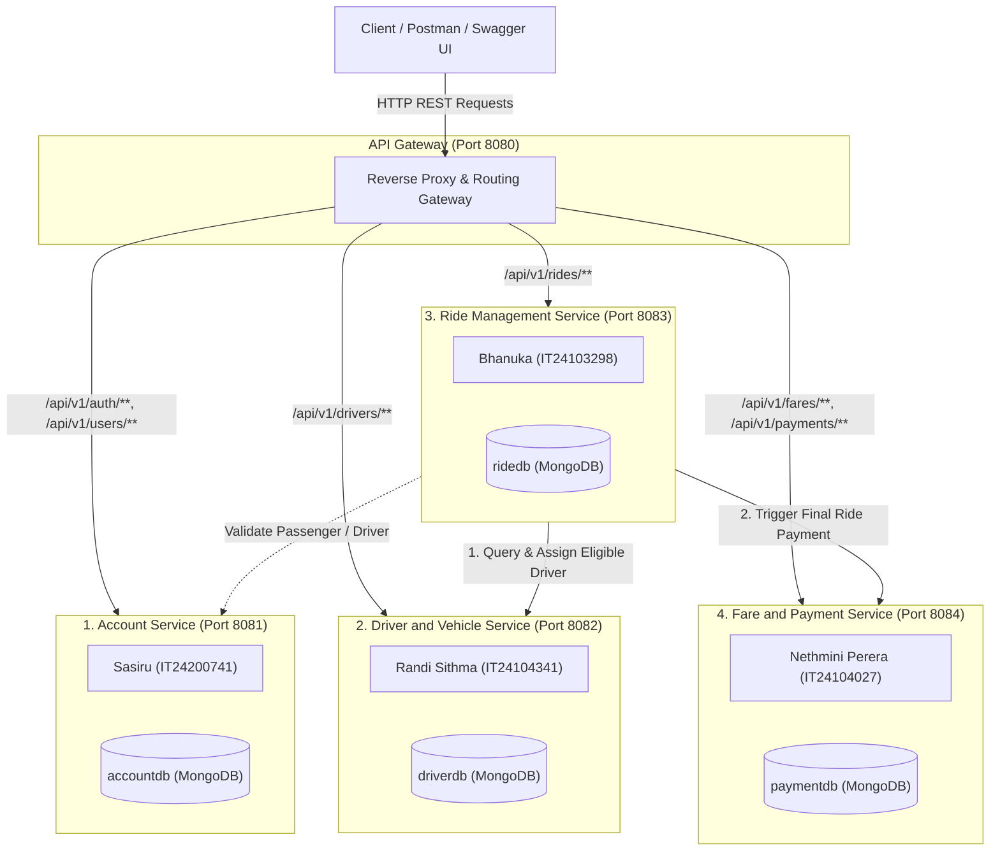

# 🚗 RideLink · Java Spring Boot Microservices for On-Demand Ride-Sharing

[](https://courseweb.sliit.lk)
[](#prerequisites)
[](#prerequisites)
[](#system-architecture)
[-green.svg)](#database-isolation)
[](#project-schedule)

**RideLink** is a distributed backend platform for a ride-sharing ecosystem developed for **IT3130 Application Development**. It is composed of an API Gateway and four loosely coupled, independently deployable **Java Spring Boot microservices** communicating via lightweight synchronous REST APIs, strictly adhering to the **Database-per-Service** architectural pattern with isolated MongoDB databases (`accountdb`, `driverdb`, `ridedb`, `paymentdb`).

---

## 👥 Microservice Allocation & Port Configuration

Each team member is exclusively responsible for the design, implementation, automated testing, and documentation of one independent core microservice, fronted by an API Gateway:

| # | Application / Microservice | Port | Owner & Student ID | Key Responsibilities |
|---|---|---|---|---|
| **0** | **API Gateway** | `8080` | *Joint Infrastructure* | Single Entry Point, Request Routing, Reverse Proxy, Cross-Cutting Concerns. |
| **1** | **Account Service** | `8081` | **Sasiru** (`IT24200741`) | Passenger & Driver registration, BCrypt password hashing, JWT token authentication, Role-based access control (Passenger, Driver, Admin), profile management, account status management. |
| **2** | **Driver & Vehicle Service** | `8082` | **Randi Sithma** (`IT24104341`) | Driver operational profiles, vehicle registration, Availability status toggle (`AVAILABLE`, `BUSY`, `OFFLINE`), simulated GPS tracking, driver discovery query. |
| **3** | **Ride Management Service** | `8083` | **Bhanuka** (`IT24103298`) | Ride lifecycle orchestrator (`REQUESTED` -> `ACCEPTED` -> `IN_PROGRESS` -> `COMPLETED`), dispatching to Driver Service, status state machine validation. |
| **4** | **Fare & Payment Service** | `8084` | **Nethmini Perera** (`IT24104027`) | Fare estimation algorithm (Base + Distance + Time), final fare calculation upon ride completion, payment simulation (Success/Failed), digital receipt generation. |

---

## 🏛️ System Architecture & Service Interactions



### 🗄️ Database-per-Service Isolation Rule (MongoDB)
- **Strict Isolation:** In strict accordance with course rules 3 & 4, each microservice maintains its own dedicated, isolated MongoDB database instance on `localhost:27017` (`accountdb`, `driverdb`, `ridedb`, `paymentdb`).
- **Zero Cross-DB Access:** Direct cross-database queries or shared databases across multiple microservices are **strictly prohibited**.
- **REST Communication Only:** Services exchange state and data exclusively through documented JSON REST endpoints.

---

## 🚀 Quick Start & Local Setup

### 1. Prerequisites
- **Java**: `JDK 17` (OpenJDK 17 / Eclipse Temurin)
- **MongoDB**: MongoDB Community Server 8.x running locally on default port `27017`
- **MongoDB Compass**: For GUI database inspection
- **Maven**: Maven Wrapper (`mvnw` and `mvnw.cmd`) included in the project root
- **Postman**: For API verification and grading demonstration

### 2. Clone Repository
```bash
git clone https://github.com/IT24200741/IT3130_RideLink_Microservices.git
cd IT3130_RideLink_Microservices
```

### 3. Build & Compile All Services
Using the included Maven Wrapper:
```bash
# Windows
.\mvnw.cmd clean compile

# macOS / Linux
./mvnw clean compile
```

### 4. Run Individual Microservices

Run services in separate terminal windows:

```bash
# Terminal 1: Account Service (Port 8081 - Sasiru IT24200741)
.\mvnw.cmd spring-boot:run -pl services/account-service

# Terminal 2: Driver & Vehicle Service (Port 8082 - Randi Sithma IT24104341)
.\mvnw.cmd spring-boot:run -pl services/driver-service

# Terminal 3: Ride Management Service (Port 8083 - Bhanuka IT24103298)
.\mvnw.cmd spring-boot:run -pl services/ride-service

# Terminal 4: Fare & Payment Service (Port 8084 - Nethmini Perera IT24104027)
.\mvnw.cmd spring-boot:run -pl services/payment-service
```

---

## 🧪 Automated Testing (Rubric I2: 3 Marks)

Each microservice includes an automated unit & integration test suite with positive and negative test cases using **JUnit 5**, **Mockito**, and **Spring Boot Test**:

```bash
# Run tests for all services across the multi-module project
.\mvnw.cmd test

# Or run tests specifically for Account Service (27 Automated Tests)
.\mvnw.cmd test -pl services/account-service
```

---

## 📮 Postman Collection & Evaluation Workflow (Rubric G3: 3 Marks)

Import the test suites located in the `/postman` directory:
1. `postman/Account_Service_Postman_Collection.json` (Full Positive and Negative test suite for Account Service with 14 automated test assertions)
2. `postman/RideLink_API_Collection.json` & `postman/RideLink_Local_Environment.json`

### Account Service Happy & Negative Path Test Cases:
1. **Health Check (`GET /health`)** -> `200 OK`
2. **Passenger Registration (`POST /api/v1/auth/register`)** -> `201 Created`
3. **Driver Registration (`POST /api/v1/auth/register`)** -> `201 Created`
4. **Duplicate Email Conflict (`POST /api/v1/auth/register`)** -> `409 Conflict`
5. **Admin Self-Registration Block (`POST /api/v1/auth/register`)** -> `400 Bad Request`
6. **Login Passenger (`POST /api/v1/auth/login`)** -> `200 OK` + JWT Token
7. **Login Invalid Credentials (`POST /api/v1/auth/login`)** -> `401 Unauthorized`
8. **Get User Profile by ID (`GET /api/v1/users/{id}`)** -> `200 OK`
9. **Update Profile (`PUT /api/v1/users/{id}`)** -> `200 OK`
10. **Admin Update Account Status (`PATCH /api/v1/users/{id}/status`)** -> `200 OK`
11. **Login Suspended Account (`POST /api/v1/auth/login`)** -> `403 Forbidden`
12. **RBAC Privilege Enforcement (`GET /api/v1/users`)** -> `403 Forbidden` for Passenger, `200 OK` for Admin

---

## 🌿 Git Branching Strategy (Rubric I3: 3 Marks)

To ensure full individual contribution marks:
- **`main`**: Production-ready, stable releases only. Protected branch.
- **`develop`**: Integration branch for combining tested services.
- **Feature Branches**: Each member works strictly on their individual branch:
  - `feature/account-service` (**Sasiru** - `IT24200741`)
  - `feature/driver-service` (**Randi Sithma** - `IT24104341`)
  - `feature/ride-service` (**Bhanuka** - `IT24103298`)
  - `feature/payment-service` (**Nethmini Perera** - `IT24104027`)

---

## 📄 License & Academic Integrity
Developed as part of the **IT3130 Application Development** course module at SLIIT. All code submitted is original group work in accordance with the SLIIT Academic Honesty Policy.
