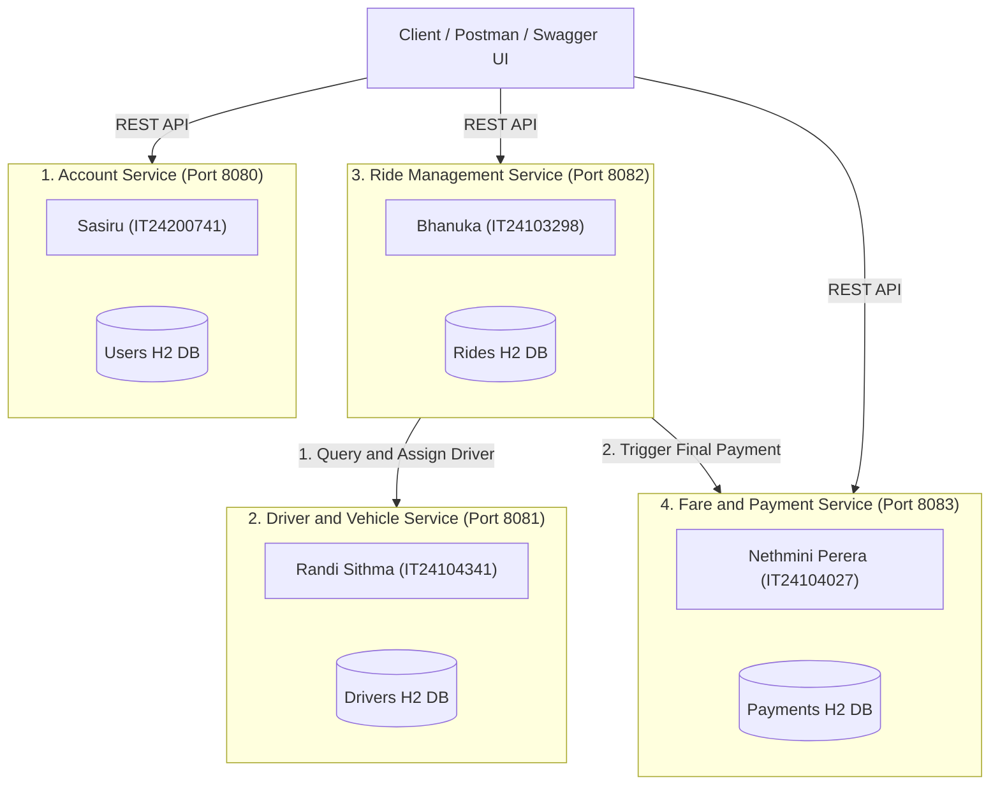

# 🚗 RideLink · Java Spring Boot Microservices for On-Demand Ride-Sharing

[](https://courseweb.sliit.lk)
[](#prerequisites)
[](#prerequisites)
[](#system-architecture)
[](#database-isolation)
[](#project-schedule)

**RideLink** is a distributed backend platform for a ride-sharing ecosystem developed for **IT3130 Application Development**. It is composed of four loosely coupled, independently deployable **Java Spring Boot microservices** communicating via lightweight synchronous REST APIs, strictly adhering to the **Database-per-Service** architectural pattern with isolated H2 databases.

---

## 👥 Microservice Allocation & Team Ownership

Each team member is exclusively responsible for the design, implementation, automated unit testing, and documentation of one independent microservice:

| # | Microservice | Port | Owner & Student ID | Key Responsibilities |
|---|---|---|---|---|
| **1** | **Account Service** | `8080` | **Sasiru** (`IT24200741`) | Passenger & Driver registration, BCrypt password hashing, JWT token authentication, Role-based access control (Passenger, Driver, Admin), profile management. |
| **2** | **Driver & Vehicle Service** | `8081` | **Randi Sithma** (`IT24104341`) | Driver operational profiles, vehicle registration, Availability status toggle (`AVAILABLE`, `BUSY`, `OFFLINE`), simulated GPS tracking, driver discovery query. |
| **3** | **Ride Management Service** | `8082` | **Bhanuka** (`IT24103298`) | Ride lifecycle orchestrator (`REQUESTED` -> `ACCEPTED` -> `IN_PROGRESS` -> `COMPLETED`), dispatching to Driver Service, status state machine validation. |
| **4** | **Fare & Payment Service** | `8083` | **Nethmini Perera** (`IT24104027`) | Fare estimation algorithm (Base + Distance + Time), final fare calculation upon ride completion, payment simulation (Success/Failed), digital receipt generation. |

---

## 🏛️ System Architecture & Service Interactions



### 🗄️ Database-per-Service Isolation Rule
- **Strict Isolation:** Each microservice has its own isolated in-memory/persistent H2 database instance (`accountdb`, `driverdb`, `ridedb`, `paymentdb`).
- **Zero Cross-DB Access:** Direct cross-database SQL queries, multi-database transactions, or foreign joins are **strictly forbidden**.
- **API Communication Only:** Services exchange state exclusively through documented JSON REST endpoints using Spring's `RestClient`.

---

## 🚀 Quick Start & Local Setup

### 1. Prerequisites
- **Java**: `JDK 17` (OpenJDK 17 / Eclipse Temurin)
- **Maven**: Maven Wrapper (`mvnw` and `mvnw.cmd`) included in the project root
- **Postman**: For API testing and demonstration
- **Git**: Configured with your SLIIT university email and ID

### 2. Clone Repository
```bash
git clone https://github.com/IT24200741/IT3130_RideLink_Microservices.git
cd IT3130_RideLink_Microservices
```

### 3. Build & Compile All Services
Using the included Maven Wrapper:
```bash
# Windows
.\mvnw.cmd clean compile

# macOS / Linux
./mvnw clean compile
```

### 4. Run Individual Microservices

Open 4 separate terminal windows or run using Maven:

```bash
# Terminal 1: Account Service (Port 8080 - Sasiru IT24200741)
.\mvnw.cmd spring-boot:run -pl services/account-service

# Terminal 2: Driver & Vehicle Service (Port 8081 - Randi Sithma IT24104341)
.\mvnw.cmd spring-boot:run -pl services/driver-service

# Terminal 3: Ride Management Service (Port 8082 - Bhanuka IT24103298)
.\mvnw.cmd spring-boot:run -pl services/ride-service

# Terminal 4: Fare & Payment Service (Port 8083 - Nethmini Perera IT24104027)
.\mvnw.cmd spring-boot:run -pl services/payment-service
```

---

## 🧪 Automated Unit Testing (Rubric I2: 3 Marks)

Each microservice includes an automated unit test suite with positive and negative test cases using **JUnit 5** and **Spring Boot Test**:

```bash
# Run tests for all 4 services at once
.\mvnw.cmd test

# Or run tests for a specific service:
.\mvnw.cmd test -pl services/account-service
.\mvnw.cmd test -pl services/driver-service
.\mvnw.cmd test -pl services/ride-service
.\mvnw.cmd test -pl services/payment-service
```

---

## 📮 Postman Collection & Evaluation Workflow (Rubric G3: 3 Marks)

Import the provided Postman collection located in `/postman`:
1. `RideLink_API_Collection.json`
2. `RideLink_Local_Environment.json`

### Recommended Happy Path Execution Order:
1. **Account Service (`:8080`)**: Register & Login Passenger (`POST /api/v1/auth/register`) -> Extracts JWT Token.
2. **Account Service (`:8080`)**: Register & Login Driver (`POST /api/v1/auth/register`).
3. **Driver Service (`:8081`)**: Create Driver Profile & Set Status `AVAILABLE` (`PATCH /api/v1/drivers/:id/status`).
4. **Driver Service (`:8081`)**: Update current GPS location (`PATCH /api/v1/drivers/:id/location`).
5. **Fare Service (`:8083`)**: Estimate Ride Fare (`POST /api/v1/fares/estimate`).
6. **Ride Service (`:8082`)**: Create Ride Request (`POST /api/v1/rides`).
7. **Ride Service (`:8082`)**: Discover & Assign Driver (`POST /api/v1/rides/:id/assign`).
8. **Ride Service (`:8082`)**: Update ride status to `IN_PROGRESS` -> `COMPLETED`.
9. **Payment Service (`:8083`)**: Process Ride Payment (`POST /api/v1/payments/process`).
10. **Payment Service (`:8083`)**: Get Receipt (`GET /api/v1/payments/:id/receipt`).

---

## 🌿 Git Branching Strategy (Rubric I3: 3 Marks)

To ensure full individual contribution marks:
- **`main`**: Production-ready, stable releases only. Protected branch.
- **`develop`**: Integration branch for combining tested services.
- **Feature Branches**: Each member works strictly on their individual branch:
  - `feature/IT24200741-account-service` (**Sasiru** - `IT24200741`)
  - `feature/IT24104341-driver-service` (**Randi Sithma** - `IT24104341`)
  - `feature/IT24103298-ride-service` (**Bhanuka** - `IT24103298`)
  - `feature/IT24104027-payment-service` (**Nethmini Perera** - `IT24104027`)

### Commit Message Conventions:
- `feat(account): add passenger registration endpoint with BCrypt`
- `fix(driver): correct driver status transition to OFFLINE`
- `test(ride): add unit tests for ride status state machine`
- `docs(payment): update OpenAPI specification for payment receipt`

---

## 📄 License & Academic Integrity
Developed as part of the **IT3130 Application Development** course module at SLIIT. All code submitted is original group work in accordance with the SLIIT Academic Honesty Policy.
